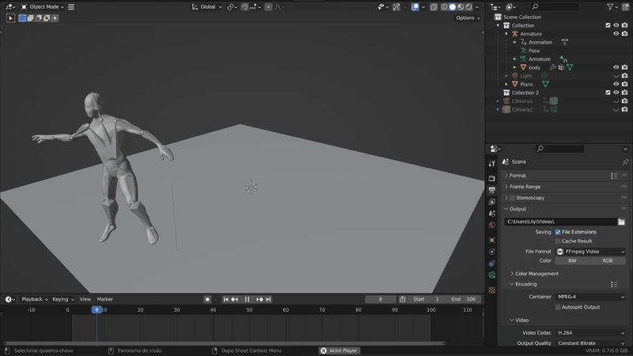
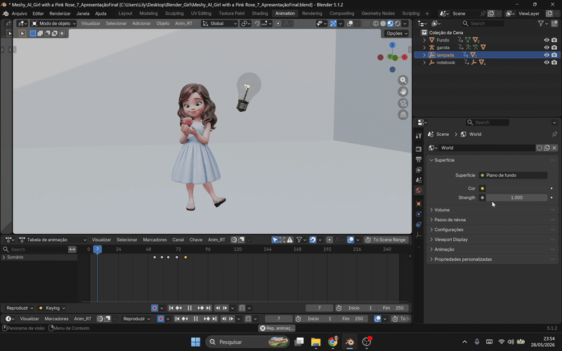

# 3D Animations

  
  

A collection of 3D character and prop animations created in [Blender](https://www.blender.org/), covering modeling, rigging, and keyframe animation.

## Animations

### Bone Animation

Skeletal rig used to test bone constraints and a basic walk cycle.

**Files:** [`bone-animation/blend`](bone-animation/blend)

### Girl Animation

Character animation featuring a rigged girl model interacting with a rose, a lamp, and a notebook prop.

**Files:** [`girl-animation/blend`](girl-animation/blend) · [`girl-animation/glb`](girl-animation/glb) · [`girl-animation/image`](girl-animation/image)

## Tools

- [Blender](https://www.blender.org/) — modeling, rigging, and animation

## License

This project is licensed under the [MIT License](LICENSE).
