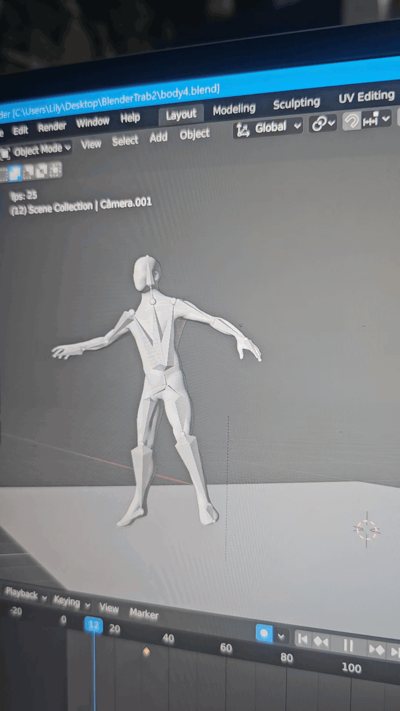
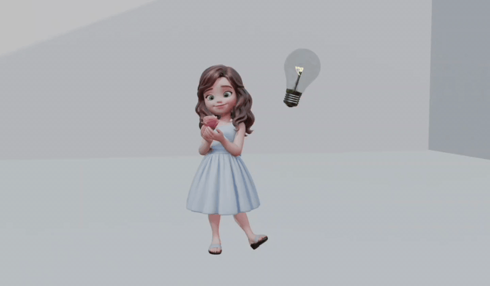

# 3D Animations

A collection of 3D animations created in [Blender](https://www.blender.org/).

## Animations

**Bone Animation**

**Girl Animation**

## Tools

- [Blender](https://www.blender.org/) — modeling, rigging and animation
